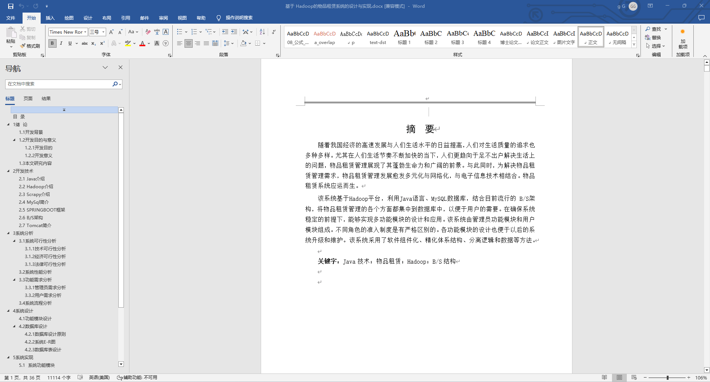
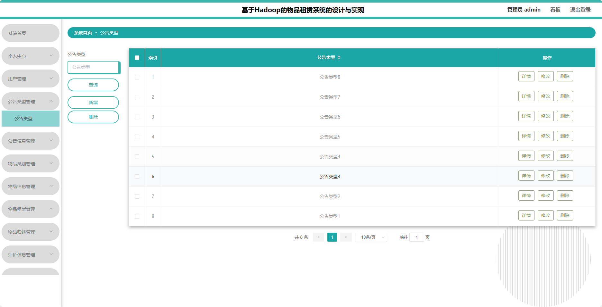
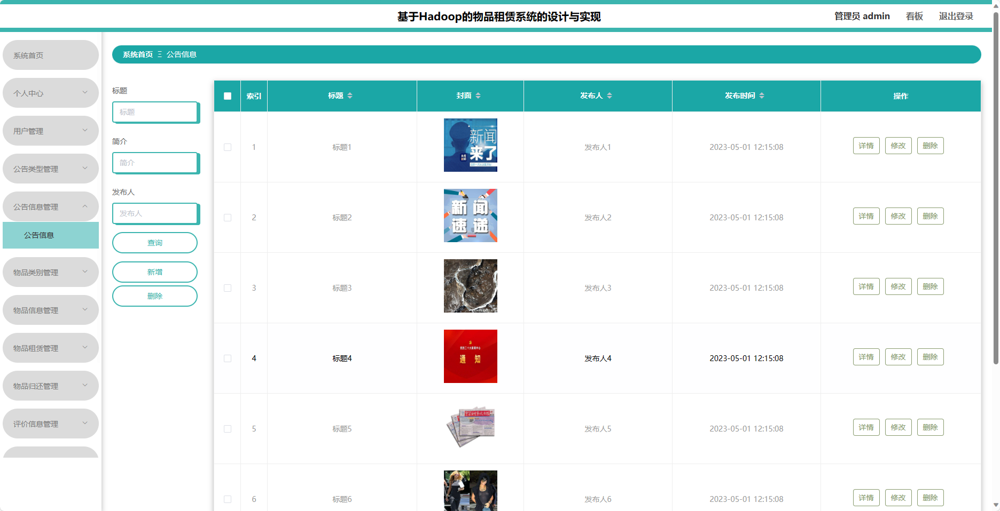
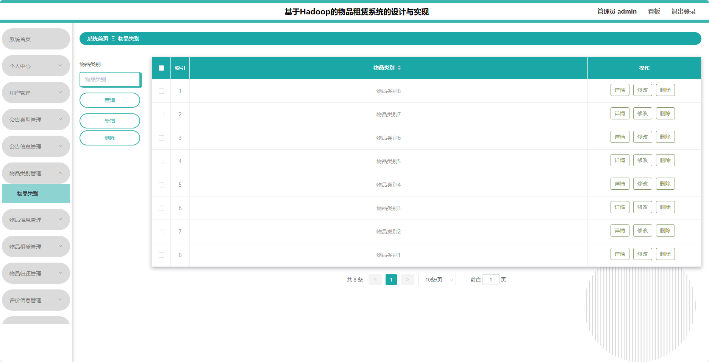
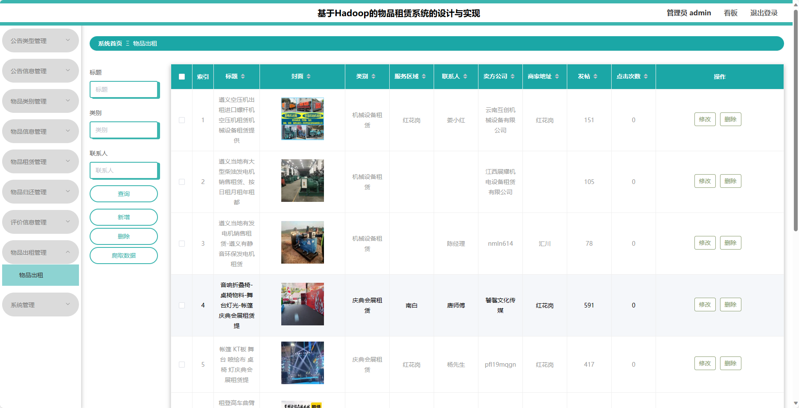
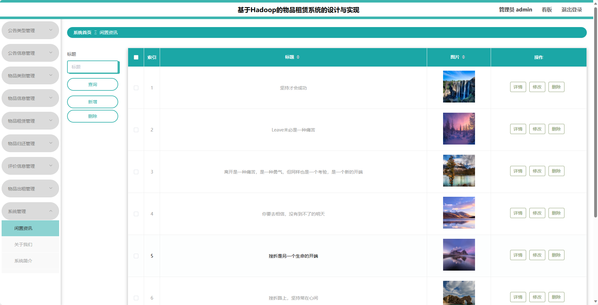
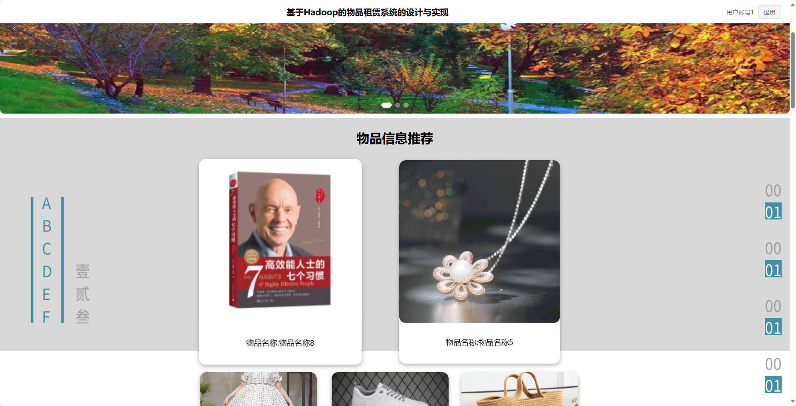
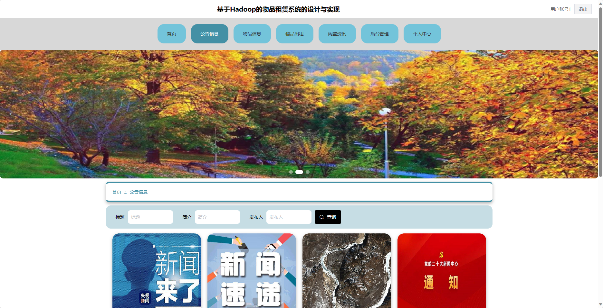
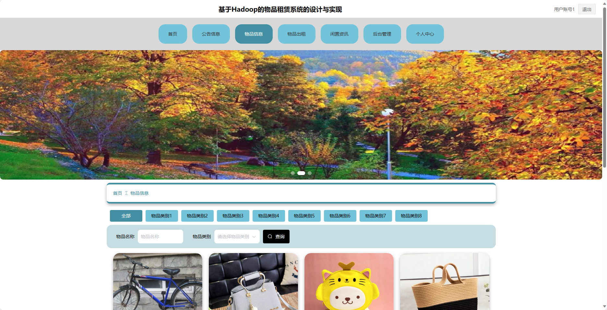
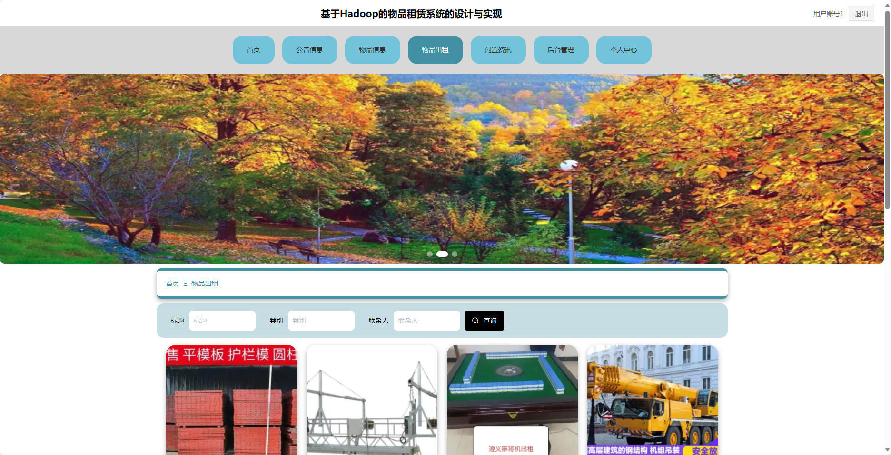

## 基于SpringBoot的物品租赁系统(程序+报告)

- <b>完整代码获取地址：从戎源码网 ([https://armycodes.com/](https://armycodes.com/))</b>
- <b>技术探讨、资料分享，请加QQ群：692619798</b> 
- <b>作者微信：19941326836  QQ：952045282</b> 
- <b>承接计算机毕业设计、Java毕业设计、Python毕业设计、深度学习、机器学习</b>
- <b>选题+开题报告+任务书+程序定制+安装调试+论文+答辩ppt 一条龙服务</b>
- <b>所有选题地址 ([https://github.com/YuLin-Coder/AllProjectCatalog](https://github.com/YuLin-Coder/AllProjectCatalog)) </b>

## 项目介绍
基于SpringBoot的物品租赁系统，系统包含两种角色：管理员、用户,系统分为前台和后台两大模块，主要功能如下。

### 【管理员】:
1. 个人中心：管理员可以管理个人信息，包括修改密码等操作。
2. 用户管理：管理员可以管理用户信息，包括添加、编辑、删除等操作。
3. 公告类型管理：管理员可以管理公告类型，包括添加、编辑、删除等操作。
4. 公告信息管理：管理员可以管理公告信息，包括添加、编辑、删除等操作。
5. 物品类别管理：管理员可以管理物品类别，包括添加、编辑、删除等操作。
6. 物品信息管理：管理员可以管理物品信息，包括添加、编辑、删除等操作。
7. 物品租赁管理：管理员可以管理物品租赁信息，包括查看租赁记录、审核租赁申请等操作。
8. 物品归还管理：管理员可以管理物品归还信息，包括确认归还、计算租金等操作。
9. 评价信息管理：管理员可以管理用户对物品的评价信息，包括查看评价、回复评价等操作。
10. 物品出租管理：管理员可以管理物品的出租信息，包括添加、编辑、删除等操作。
11. 系统管理：管理员可以管理系统的基础数据和配置，包括用户信息、权限管理等。

### 【前台】:
1. 首页：展示系统的基础信息和操作入口。
2. 公告信息：展示系统的公告信息，包括公告标题、发布时间等。
3. 物品信息：展示系统的物品信息，包括物品名称、价格、押金等。
4. 物品出租：用户可以选择物品进行租赁，包括选择物品数量、租赁时间等。
5. 闲置资讯：展示系统的闲置物品信息，包括闲置物品名称、价格等。

## 项目技术
- 编程语言：Java
- 数据库：MySQL
- 项目管理工具：Maven
- 前端技术：HTML、CSS、JavaScript、Jquery、Vue
- 后端技术：Spring、SpringMVC、MyBatis

## 运行环境
- JDK版本：JDK1.8及以上
- 开发工具：IDEA、Ecplise、Myecplise都可以
- 数据库: MySQL5.7及以上
- Maven：maven3.0及以上
- Node：14.14.0及以上

## 运行截图

